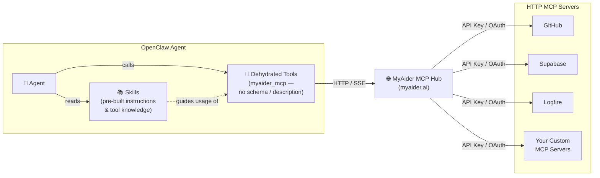

# openclaw-myaider

**[MyAider.ai](https://www.myaider.ai)** is probably the first **skillful MCP hub**. Instead of relying on tool descriptions and schemas at runtime, MyAider uses **tool-based skills** — pre-built skill files that already contain all the instructions and tool details agents need. This means:

- 🚀 **Zero token overhead** — tools on the MCP server have no descriptions or schemas; all the knowledge is embedded in skill files.
- 🧠 **Skill-driven tool use** — skills tell the agent exactly how to call each tool, so no MCP introspection is needed at runtime.
- 📦 **Living skill library** — import, upgrade, and sync skills directly from [myaider.ai](https://www.myaider.ai), keeping your agent up to date automatically.

This repository provides the **myaider** plugin for [OpenClaw](https://openclaw.ai), connecting OpenClaw agents to the MyAider MCP hub.

---

## MyAider as an MCP Hub

[MyAider.ai](https://www.myaider.ai) acts as a **universal MCP hub** — a central gateway that connects your AI agent to many MCP-compatible services through a single endpoint:

- 🔗 **Pre-integrated services** — connect to popular MCP servers like **GitHub**, **Supabase**, **Logfire**, and more using your existing **API key** or **OAuth** credentials, all managed securely on the MyAider platform.
- 🛠️ **Custom skills** — define and host your own skills on MyAider, making them instantly available to any agent connected to the hub.
- 🔑 **Secure credential management** — OAuth flows and API keys are handled by MyAider, so your agent never needs to juggle individual service credentials.
- ⚡ **Dehydrated tools** — tools exposed through the hub carry no descriptions or schemas, keeping your agent's context lean while skills provide all the necessary knowledge.

### Architecture

The diagram below shows how an OpenClaw agent, skills, dehydrated tools, and the MyAider MCP hub connect to downstream HTTP MCP servers:



---

## What does the plugin do?

- Implements a native MCP HTTP client so OpenClaw agents can talk to the MyAider MCP server.
- Registers the **`myaider_mcp`** agent tool for calling MyAider tools directly.
- Provides two skills:
  - **`myaider-mcp`** — lets agents list and call tools on the MyAider MCP server.
  - **`myaider-skill-importer`** — imports and upgrades dynamic skills from MyAider into OpenClaw.

---

## Installation

```bash
openclaw plugins install myaider
```

Or install from source:

```bash
cd ~/.openclaw/extensions/
git clone https://github.com/hurungang/openclaw-myaider.git
cd openclaw-myaider/myaider
npm install
openclaw gateway restart
```

---

## Quick Start

1. **Get your MyAider MCP URL** from [https://www.myaider.ai/mcp](https://www.myaider.ai/mcp).

2. **Configure the plugin** — either via CLI:

   ```bash
   openclaw config set plugins.entries.myaider.config.url "https://myaider.ai/api/v1/mcp?apiKey=<your-api-key>"
   ```

   or by editing `~/.openclaw/openclaw.json`:

   ```json
   {
     "plugins": {
       "entries": {
         "myaider": {
           "enabled": true,
           "config": {
             "url": "https://myaider.ai/api/v1/mcp?apiKey=<your-api-key>"
           }
         }
       }
     }
   }
   ```

3. **Allow the plugin tool for your agent (OpenClaw 2026.3.2+)**.

   Since OpenClaw 2026.3.2, default setups no longer start with broad coding/system tools unless explicitly configured. To use this plugin, allow the `myaider_mcp` tool in your agent config, for example:

   ```json
   {
     "id": "main",
     "tools": {
       "alsoAllow": [
         "myaider_mcp"
       ],
       "profile": "coding"
     }
   }
   ```

   Or in Gateway Web UI: **Agents -> <agent_name> -> Tools**, then allow `myaider_mcp`.

4. **Restart the gateway**:

   ```bash
   openclaw gateway restart
   ```

5. **Try it in OpenClaw chat**:

   ```
   List the tools available in my MyAider MCP
   ```

   ```
   Import my MyAider skills
   ```

   ```
   Upgrade my MyAider skills to the latest version
   ```

---

## License

MIT